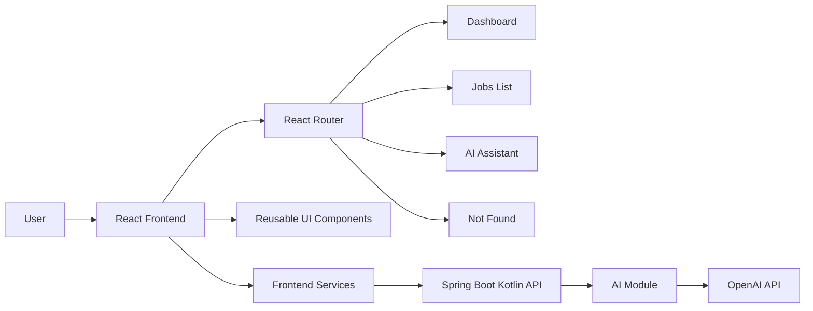
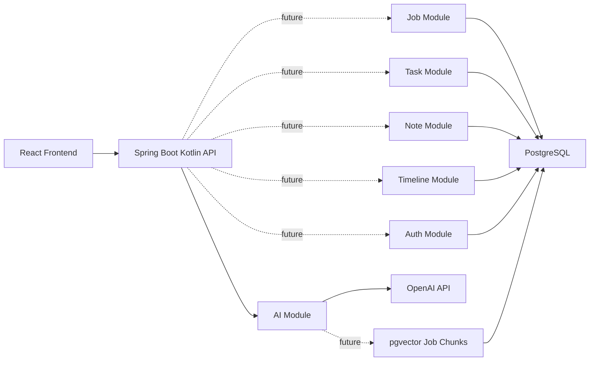
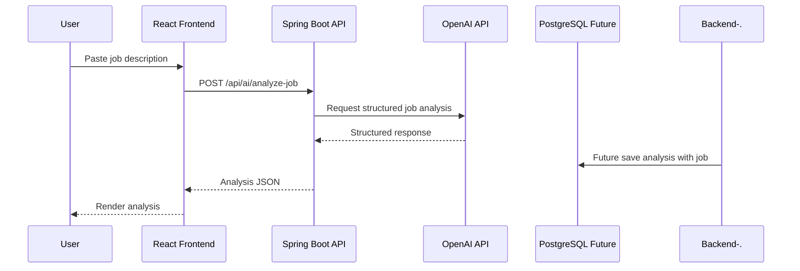
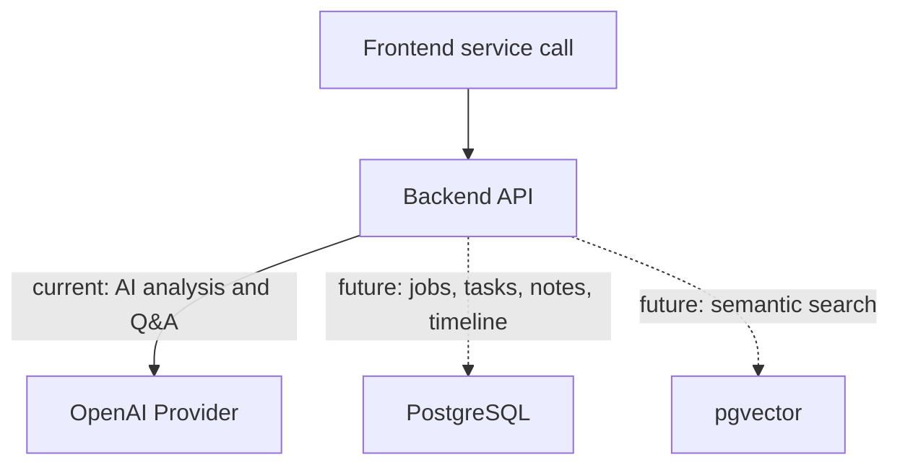

# Smart Job Tracker Architecture

## System Overview

Current runtime:



Planned tracker runtime:



## Request Flows

AI analysis currently calls the external provider and returns the result to the frontend. It does not write to a database yet.



Provider and database responsibilities:



## Frontend Structure

```text
frontend/src
  components
    appShell
    dataTable
    form
    header
    icons
    languageSelect
    sectionCard
    seniorityBadge
    ui
  data
    mockJobs.ts
    mockJobDetails.ts
  errors
  features
    analyzeJob
    askJob
    dashboard
    jobDetail
    jobs
  hooks
    useAsyncMutation
    useMediaQuery
  i18n
  pages
    analyzeJob
    dashboard
    jobDetail
    jobs
    notFound
  routes
  services
    ai
    api
  types
    ask
    error
    job
    analysis
```

## Backend Structure

```text
backend/src/main/kotlin/com/smartjobtracker
  ai
    client
    dto
    mapper
    prompt
    schema
  api
    error
  config
```

## Core Data Model

```text
User
  id, name, email, passwordHash

Job
  id, userId, company, roleTitle, location, status, jobUrl,
  salaryMin, salaryMax, description, createdAt, updatedAt

Task
  id, jobId, title, status, priority, dueDate, createdAt, updatedAt

Note
  id, jobId, content, createdAt, updatedAt

TimelineEvent
  id, jobId, type, fromStatus, toStatus, description, createdAt

AiOutput
  id, jobId, type, contentJson, createdAt

JobChunk
  id, jobId, chunkText, chunkIndex, embedding, createdAt
```

## Implementation Direction

1. Finish the frontend MVP with mock data and local persistence.
2. Add the Spring Boot Kotlin backend with PostgreSQL.
3. Replace mock data with API services.
4. Move AI features into saved job workflows.
5. Add auth, tests, Docker, deployment, and README polish.
