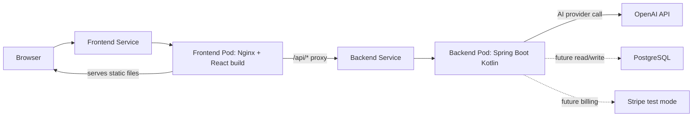
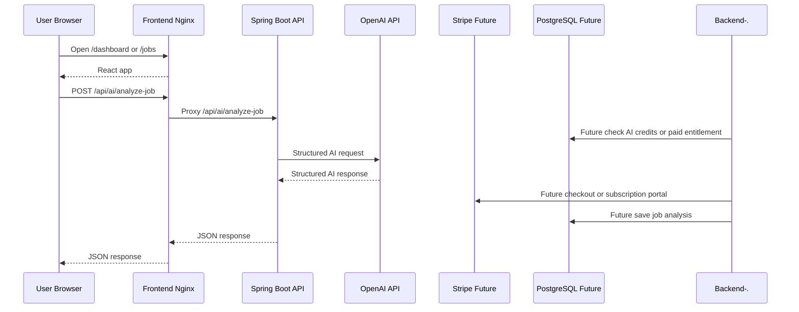
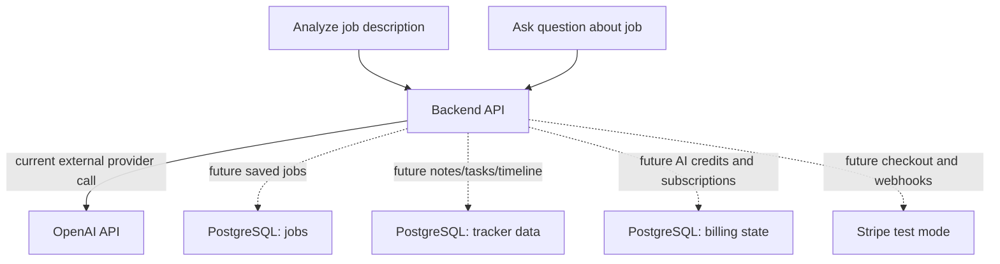

# Infrastructure

The local infrastructure is designed to feel close to production while still running on a developer machine.

## Runtime Overview



## Local Kubernetes Components

```text
Namespace
  smart-job-tracker

Frontend
  Deployment: smart-job-tracker-frontend
  Service:    smart-job-tracker-frontend
  Container:  Nginx serving frontend/dist
  Port:       80

Backend
  Deployment: smart-job-tracker-backend
  Service:    smart-job-tracker-backend
  Container:  Spring Boot Kotlin app
  Port:       4000

Config
  ConfigMap:  smart-job-tracker-backend-config
  Secret:     smart-job-tracker-secrets
```

## Request Flow



## Provider vs Database Calls

Current AI endpoints call the external provider directly and do not persist results yet.



pgvector, embeddings, job chunks, and RAG over saved job content are
deferred product ideas, not part of the active local infrastructure plan.

## Docker Images

Backend image:

```text
smart-job-tracker-backend:local
```

Built from:

```text
infra/docker/backend.Dockerfile
```

Frontend image:

```text
smart-job-tracker-frontend:local
```

Built from:

```text
infra/docker/frontend.Dockerfile
```

## Nginx Proxy

The frontend container uses Nginx:

```text
infra/docker/nginx.conf
```

Responsibilities:

- Serve the React production build.
- Rewrite frontend deep links to `index.html`.
- Proxy `/api/*` requests to the backend service.
- Expose `/healthz` for Kubernetes probes.

## Configuration

Backend runtime config comes from:

```text
infra/k8s/local/backend-configmap.yaml
```

Current config values:

```text
OPENAI_BASE_URL
OPENAI_MODEL
```

Sensitive values come from a Kubernetes Secret:

```text
smart-job-tracker-secrets
```

Current secret keys:

```text
OPENAI_API_KEY
```

The committed file `infra/k8s/local/smart-job-tracker-secrets.example.yaml` is only a template. Do not add it to `kustomization.yaml` with a real API key.

## Ports

```text
Local Vite frontend:        5173
Local Spring Boot backend:  4000
Kubernetes frontend proxy:  30080 through kubectl port-forward
Frontend container:         80
Backend container:          4000
```

## Why Image Loading Is Needed Locally

Docker Desktop Kubernetes can run its node through `containerd`, so images visible through `docker images` are not always visible to Kubernetes pods.

The script below imports local images into the Kubernetes node:

```bash
npm run k8s:load-images
```

Run it after rebuilding images and before restarting workloads.
