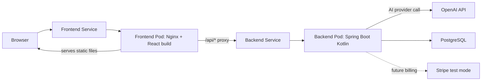
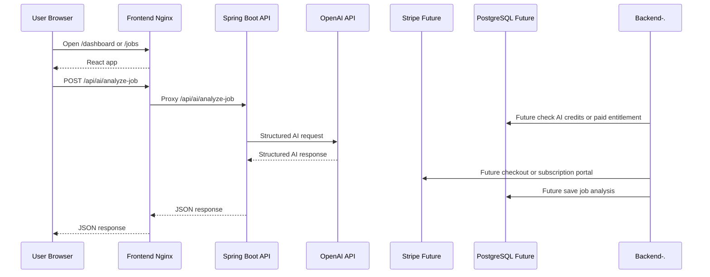
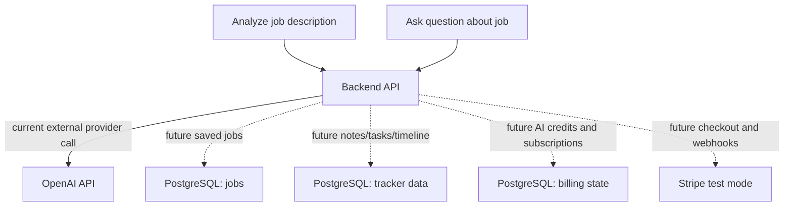

# Infrastructure

The local infrastructure is designed to feel close to production while still running on a developer machine.

## Runtime Overview


```mermaid
flowchart LR
  Browser["Browser"] --> FrontendService["Frontend Service"]
  FrontendService --> FrontendPod["Frontend Pod: Nginx + React build"]
  FrontendPod -->|"serves static files"| Browser
  FrontendPod -->|"/api/* proxy"| BackendService["Backend Service"]
  BackendService --> BackendPod["Backend Pod: Spring Boot Kotlin"]
  BackendPod -->|"AI provider call"| OpenAI["OpenAI API"]
  BackendPod --> Database["PostgreSQL"]
  BackendPod -. "future billing" .-> Stripe["Stripe test mode"]
```

## Local Kubernetes Components

```text
Namespace
  smart-job-tracker

Frontend
  Deployment: smart-job-tracker-frontend
  Service:    smart-job-tracker-frontend
  Container:  Nginx serving frontend/dist
  Port:       80

Backend
  Deployment: smart-job-tracker-backend
  Service:    smart-job-tracker-backend
  Container:  Spring Boot Kotlin app
  Port:       4000

Config
  ConfigMap:  smart-job-tracker-backend-config
  Secret:     smart-job-tracker-secrets

PostgreSQL
  Deployment: smart-job-tracker-postgres
  Service:    smart-job-tracker-postgres
  Image:      postgres:16
  Port:       5432
  Storage:    emptyDir (ephemeral; data resets on pod recreation)
```

## Docker Compose Runtime

An alternative to the Kubernetes runtime for developers who do not want
to enable Docker Desktop Kubernetes. Defined in one file:

```text
infra/docker/compose.yaml
```

```text
Project
  smart-job-tracker

Frontend
  Service:    smart-job-tracker-frontend
  Image:      smart-job-tracker-frontend:local
  Port:       30080 -> 80

Backend
  Service:    smart-job-tracker-backend
  Image:      smart-job-tracker-backend:local
  Port:       not published; reached through the frontend proxy

PostgreSQL
  Service:    smart-job-tracker-postgres
  Image:      postgres:16
  Port:       5434 -> 5432
  Storage:    named volume (survives restarts)
```

### What Is Shared With Kubernetes

- Both Dockerfiles, unchanged.
- `infra/docker/nginx.conf`, unchanged.
- The image tags `smart-job-tracker-backend:local` and
  `smart-job-tracker-frontend:local`, so a Compose build also refreshes
  what `npm run k8s:load-images` picks up.
- The published host ports, `30080` and `5434`.
- The environment variable names the backend reads.

Service names match the Kubernetes Service names deliberately. Compose
publishes service names as DNS names on the project network, and
`nginx.conf` resolves its upstream by the literal name
`smart-job-tracker-backend`. Matching the names is what lets one Nginx
config serve both runtimes.

### What Differs

| | Kubernetes | Compose |
| --- | --- | --- |
| Database storage | `emptyDir`, resets on pod recreation | named volume, survives restarts |
| Secrets | `smart-job-tracker-secrets` Secret, no defaults | `infra/docker/.env`, with local defaults |
| Startup ordering | probes and Service objects | `depends_on` with health conditions |
| Image delivery | `k8s:load-images` into the node | built in place by Compose |

Nginx resolves a literal upstream hostname when it loads its config and
exits if the name does not resolve. Under Kubernetes the Service exists
independently of the backend pod, so this never happens. Compose has no
equivalent object, so the frontend declares `depends_on` the backend.
The backend in turn waits for PostgreSQL to report healthy, because
Flyway connects during startup.

### Running It

```bash
npm run dev:compose
npm run compose:logs
npm run compose:down
npm run compose:reset
npm run compose:config
```

Because both runtimes bind `30080` and `5434`, only one can run at a
time. See [Project Setup](./setup.md) for the environment variables and
the full walkthrough.

## Request Flow


```mermaid
sequenceDiagram
  participant User as User Browser
  participant Nginx as Frontend Nginx
  participant Backend as Spring Boot API
  participant OpenAI as OpenAI API
  participant Stripe as Stripe Future
  participant DB as PostgreSQL Future

  User->>Nginx: Open /dashboard or /jobs
  Nginx-->>User: React app
  User->>Nginx: POST /api/ai/analyze-job
  Nginx->>Backend: Proxy /api/ai/analyze-job
  Backend-.->>DB: Future check AI credits or paid entitlement
  Backend->>OpenAI: Structured AI request
  OpenAI-->>Backend: Structured AI response
  Backend-.->>Stripe: Future checkout or subscription portal
  Backend-.->>DB: Future save job analysis
  Backend-->>Nginx: JSON response
  Nginx-->>User: JSON response
```

## Provider vs Database Calls

Current AI endpoints call the external provider directly and do not persist results yet.


```mermaid
flowchart TD
  Analyze["Analyze job description"] --> Api["Backend API"]
  Ask["Ask question about job"] --> Api

  Api -->|"current external provider call"| OpenAI["OpenAI API"]
  Api -. "future saved jobs" .-> JobsDb["PostgreSQL: jobs"]
  Api -. "future notes/tasks/timeline" .-> TrackerDb["PostgreSQL: tracker data"]
  Api -. "future AI credits and subscriptions" .-> BillingDb["PostgreSQL: billing state"]
  Api -. "future checkout and webhooks" .-> Stripe["Stripe test mode"]
```

pgvector, embeddings, job chunks, and RAG over saved job content are
deferred product ideas, not part of the active local infrastructure plan.

## Docker Images

Backend image:

```text
smart-job-tracker-backend:local
```

Built from:

```text
infra/docker/backend.Dockerfile
```

Frontend image:

```text
smart-job-tracker-frontend:local
```

Built from:

```text
infra/docker/frontend.Dockerfile
```

## Nginx Proxy

The frontend container uses Nginx:

```text
infra/docker/nginx.conf
```

Responsibilities:

- Serve the React production build.
- Rewrite frontend deep links to `index.html`.
- Proxy `/api/*` requests to the backend service.
- Expose `/healthz` for Kubernetes probes.

## Configuration

Backend runtime config comes from:

```text
infra/k8s/local/backend-configmap.yaml
```

Current config values:

```text
OPENAI_BASE_URL
OPENAI_MODEL
DB_URL       jdbc:postgresql://smart-job-tracker-postgres:5432/smartjobtracker
DB_USER      smartjobtracker
```

PostgreSQL runtime config comes from:

```text
infra/k8s/local/postgres-configmap.yaml
```

Current config values:

```text
POSTGRES_DB    smartjobtracker
POSTGRES_USER  smartjobtracker
```

The database password for both PostgreSQL and the backend datasource
comes from the `smart-job-tracker-secrets` Secret:

```text
POSTGRES_PASSWORD
```

In-cluster hostname: `smart-job-tracker-postgres`
Port: `5432`

Sensitive values come from a Kubernetes Secret:

```text
smart-job-tracker-secrets
```

Current secret keys:

```text
OPENAI_API_KEY
POSTGRES_PASSWORD
```

The committed file `infra/k8s/local/smart-job-tracker-secrets.example.yaml` is only a template. Do not add it to `kustomization.yaml` with a real API key.

Create or recreate the secret with both required keys using:

```bash
npm run k8s:create-secret
```

If you created the secret before `task-001`, it will be missing `POSTGRES_PASSWORD` and the Postgres pod will fail to start. Recreate it with the command above.

## Ports

```text
Local Vite frontend:        5173
Local Spring Boot backend:  4000
Kubernetes frontend proxy:  30080 through kubectl port-forward
Compose frontend:           30080 published directly
Frontend container:         80
Backend container:          4000
PostgreSQL host port-forward:  5434 -> 5432
Compose PostgreSQL:         5434 published directly
PostgreSQL container:       5432
```

The Kubernetes and Compose runtimes claim the same two host ports,
so they cannot run at the same time.

## Why Image Loading Is Needed Locally

Docker Desktop Kubernetes can run its node through `containerd`, so images visible through `docker images` are not always visible to Kubernetes pods.

The script below imports local images into the Kubernetes node:

```bash
npm run k8s:load-images
```

Run it after rebuilding images and before restarting workloads.
